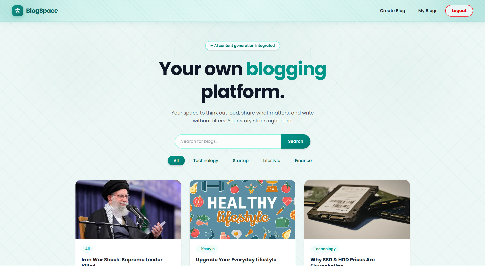
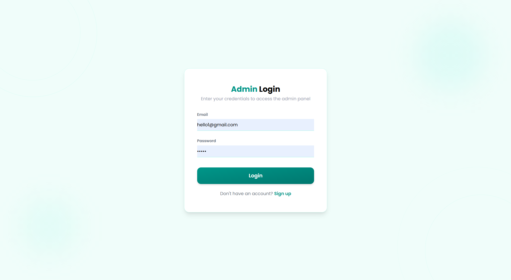
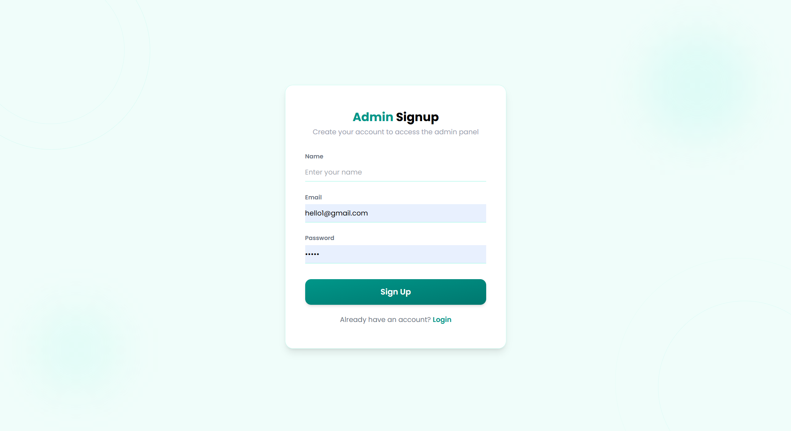
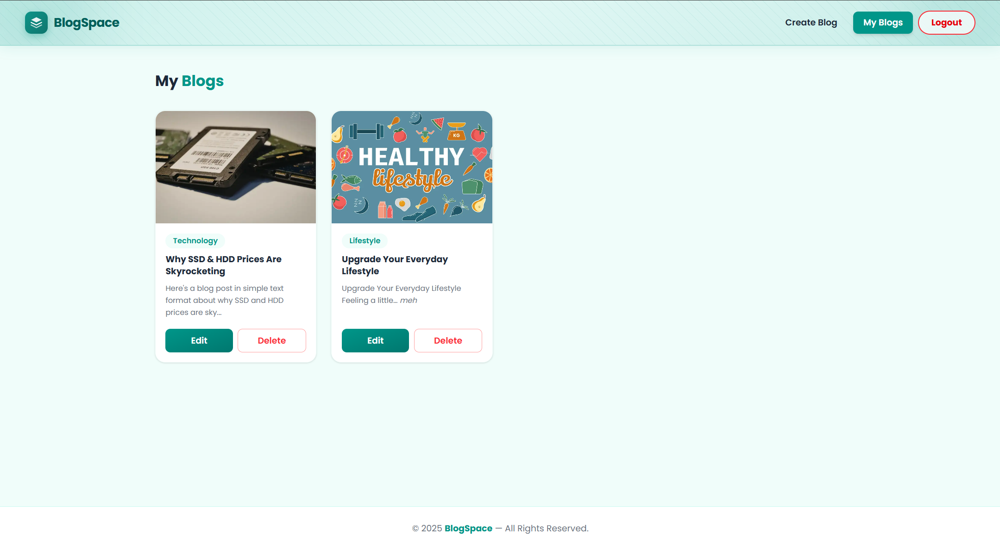
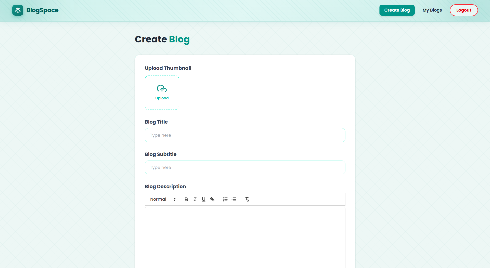

# 📝 BlogSpace

A full-stack blogging platform where users can sign up, create, edit, and delete blogs — with AI-powered content generation using Google Gemini.

---

## 🚀 Features

- 🔐 Admin signup & login with JWT authentication
- ✍️ Create, edit, and delete blog posts
- 🤖 AI content generation powered by Google Gemini
- 🖼️ Image upload via ImageKit CDN
- 🔍 Search blogs by keyword
- 🏷️ Filter blogs by category
- 📱 Fully responsive UI built with React + Tailwind CSS
- 🎨 Clean teal-themed design

---

## 📸 Screenshots

### Home Page


### Login Page


### Signup Page


### My Blogs


### Create Blog


### Blog Detail


## 🛠️ Tech Stack

### Frontend
| Tech | Purpose |
|------|---------|
| React 19 | UI framework |
| Vite | Build tool |
| Tailwind CSS | Styling |
| React Router DOM | Client-side routing |
| Axios | HTTP requests |
| React Hot Toast | Notifications |
| Quill.js | Rich text editor |
| Marked.js | Markdown parser |
| Moment.js | Date formatting |

### Backend
| Tech | Purpose |
|------|---------|
| Node.js + Express | Server |
| MongoDB + Mongoose | Database |
| JWT | Authentication |
| bcryptjs | Password hashing |
| Multer | File upload handling |
| ImageKit | Image CDN storage |
| Google Gemini API | AI content generation |
| Cookie Parser | Cookie management |
| CORS | Cross-origin requests |

---

## 📁 Project Structure

```
niteshsingh-26-blogspace/
├── client/                     # React frontend
│   ├── public/
│   ├── src/
│   │   ├── components/
│   │   │   ├── Navbar.jsx
│   │   │   ├── Footer.jsx
│   │   │   ├── BlogCard.jsx
│   │   │   ├── AdminBlogCard.jsx
│   │   │   └── Loader.jsx
│   │   ├── context/
│   │   │   ├── AppContext.jsx
│   │   │   └── UseAppContext.jsx
│   │   ├── pages/
│   │   │   ├── Home.jsx
│   │   │   ├── Blog.jsx
│   │   │   ├── Login.jsx
│   │   │   ├── SignUp.jsx
│   │   │   ├── AddBlog.jsx
│   │   │   ├── EditBlog.jsx
│   │   │   └── MyBlog.jsx
│   │   ├── App.jsx
│   │   ├── main.jsx
│   │   └── index.css
│   ├── index.html
│   └── package.json
│
└── server/                     # Express backend
    ├── config/
    │   ├── db.js
    │   ├── gemini.js
    │   └── imageKit.js
    ├── controllers/
    │   ├── adminController.js
    │   └── blogController.js
    ├── middleware/
    │   ├── authMiddleware.js
    │   └── multerMiddleware.js
    ├── models/
    │   ├── blog.js
    │   └── user.js
    ├── routes/
    │   ├── adminRoutes.js
    │   └── blogRoutes.js
    ├── index.js
    └── package.json
```

---

## ⚙️ Setup & Installation

### Prerequisites
- Node.js v18+
- MongoDB Atlas account
- ImageKit account
- Google Gemini API key

---

### 1. Clone the repository
```bash
git clone https://github.com/YOUR_USERNAME/blogspace.git
cd blogspace
```

---

### 2. Setup the Server

```bash
cd server
npm install
```

Create a `.env` file in the `server/` folder:
```env
PORT=3000
SECRET_KEY=your_jwt_secret
MONGODB_URI=your_mongodb_connection_string
GEMINI_API_KEY=your_gemini_api_key
IMAGEKIT_PUBLIC_KEY=your_imagekit_public_key
IMAGEKIT_PRIVATE_KEY=your_imagekit_private_key
IMAGEKIT_URL_ENDPOINT=your_imagekit_url_endpoint
CLIENT_URL=http://localhost:5173
```

Start the server:
```bash
npm run dev
# or
node index.js
```

Server runs on **http://localhost:3000**

---

### 3. Setup the Client

```bash
cd client
npm install
```

Create a `.env` file in the `client/` folder:
```env
VITE_BASE_URL=http://localhost:3000
```

Start the client:
```bash
npm run dev
```

Client runs on **http://localhost:5173**

---

## 🔗 API Endpoints

### Blog Routes (`/api/blog`)
| Method | Endpoint | Description | Auth |
|--------|----------|-------------|------|
| POST | `/signup` | Register new user | ❌ |
| POST | `/login` | Login user | ❌ |
| GET | `/profile` | Get logged-in user profile | ✅ |
| POST | `/logout` | Logout user | ❌ |
| GET | `/all` | Get all blogs | ❌ |
| GET | `/:blogId` | Get single blog | ❌ |
| GET | `/` | Get blogs with search/filter | ❌ |

### Admin Routes (`/api/admin`)
| Method | Endpoint | Description | Auth |
|--------|----------|-------------|------|
| POST | `/add` | Create new blog | ✅ |
| PUT | `/updateBlog/:id` | Update blog | ✅ |
| DELETE | `/deleteBlog/:id` | Delete blog | ✅ |
| POST | `/generateContent` | Generate AI content | ✅ |

---


---


## 👤 Author

**Nikhil** 
> Built with ❤️ and a lot of teal 🟢
