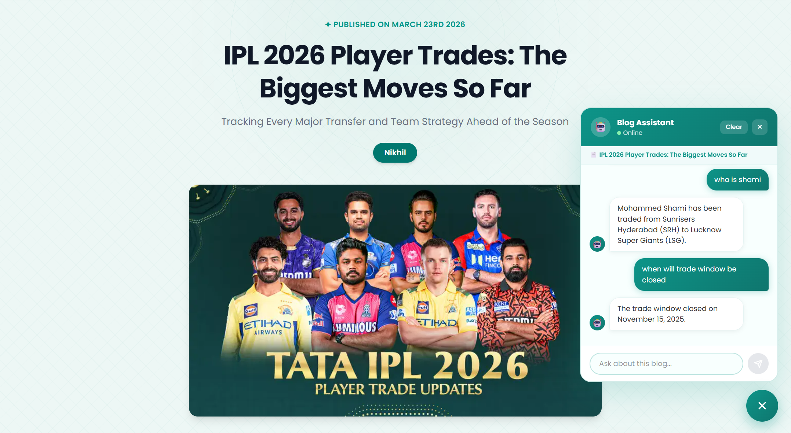

# 📝 BlogSpace

An AI-Powered full-stack blogging platform where users can sign up, create, edit, and delete blogs — with AI content generation and a RAG-based chatbot powered by Google Gemini, LangChain and local embeddings.

---

## 🚀 Features

- 🔐 Admin signup & login with JWT authentication
- ✍️ Create, edit, and delete blog posts
- 🤖 AI content generation powered by Google Gemini + Google Search grounding
- 🧠 RAG-based AI chatbot for context-aware Q&A on each blog
- 🖼️ Image upload via ImageKit CDN
- 🔍 Search blogs by keyword
- 🏷️ Filter blogs by category
- 📱 Fully responsive UI built with React + Tailwind CSS
- 🎨 Clean teal-themed design
- ⚡ Local embeddings (zero API calls) + MongoDB caching for instant responses

---

## 📸 Screenshots

### Home Page


### Login Page


### Signup Page


### My Blogs


### ChatBot


### Create Blog


### Blog Detail


---

## 🛠️ Tech Stack

### Frontend
| Tech | Purpose |
|------|---------|
| React 19 | UI framework |
| Vite | Build tool |
| Tailwind CSS | Styling |
| React Router DOM | Client-side routing |
| Axios | HTTP requests |
| React Hot Toast | Notifications |
| Quill.js | Rich text editor |
| Marked.js | Markdown parser |
| Moment.js | Date formatting |

### Backend
| Tech | Purpose |
|------|---------|
| Node.js + Express | Server |
| MongoDB + Mongoose | Database |
| JWT | Authentication |
| bcryptjs | Password hashing |
| Multer | File upload handling |
| ImageKit | Image CDN storage |
| Google Gemini API | AI content generation + chatbot LLM |
| LangChain.js | Text chunking (RAG pipeline) |
| Xenova Transformers | Local embeddings (zero API calls) |
| Cookie Parser | Cookie management |
| CORS | Cross-origin requests |

---

## 🧠 RAG Chatbot Architecture

Each blog has a context-aware AI chatbot powered by a full RAG pipeline:

```
User Question
↓
Xenova Local Model (question → vector, instant, no API!)
↓
Cosine Similarity Search on cached blog chunks
↓
Top 3 Relevant Chunks Retrieved
↓
Google Gemini (context + question + history)
↓
Answer strictly based on blog content
```

**Pipeline steps:**
1. Blog content fetched from MongoDB
2. LangChain splits blog into 1000-char chunks with 100-char overlap
3. Xenova `all-MiniLM-L6-v2` runs locally on server — converts chunks to embeddings
4. Embeddings cached in MongoDB — generated only once per blog forever
5. User question embedded locally (instant, zero network call)
6. Cosine similarity finds top 3 most relevant chunks
7. Top 3 chunks + question + chat history passed to Gemini
8. Gemini answers strictly based on retrieved blog content

**Why local embeddings:**
- Zero API calls for embeddings = instant response
- No rate limits, no cost, works offline
- Same model quality as HuggingFace API

---

## 📁 Project Structure

```
nikburner-blogspace/
├── client/                     
│   ├── src/
│   │   ├── components/
│   │   │   ├── Navbar.jsx
│   │   │   ├── Footer.jsx
│   │   │   ├── BlogCard.jsx
│   │   │   ├── AdminBlogCard.jsx
│   │   │   ├── Loader.jsx
│   │   │   └── ChatBot.jsx         # RAG chatbot widget
│   │   ├── context/
│   │   │   ├── AppContext.jsx
│   │   │   └── UseAppContext.jsx
│   │   ├── pages/
│   │   │   ├── Home.jsx
│   │   │   ├── Blog.jsx
│   │   │   ├── Login.jsx
│   │   │   ├── SignUp.jsx
│   │   │   ├── AddBlog.jsx
│   │   │   ├── EditBlog.jsx
│   │   │   └── MyBlog.jsx
│   │   ├── App.jsx
│   │   ├── main.jsx
│   │   └── index.css
│   ├── index.html
│   └── package.json
│
└── server/                     
    ├── config/
    │   ├── db.js
    │   ├── gemini.js
    │   └── imageKit.js
    ├── controllers/
    │   ├── adminController.js
    │   ├── blogController.js
    │   └── chatController.js       # RAG chatbot logic
    ├── middleware/
    │   ├── authMiddleware.js
    │   └── multerMiddleware.js
    ├── models/
    │   ├── blog.js                 # includes chunkTexts + chunkEmbeddings cache
    │   └── user.js
    ├── routes/
    │   ├── adminRoutes.js
    │   ├── blogRoutes.js
    │   └── chatRoutes.js           # chat API route
    ├── index.js
    └── package.json
```

---

## ⚙️ Setup & Installation

### Prerequisites
- Node.js v18+
- MongoDB Atlas account
- ImageKit account
- Google Gemini API key

---

### 1. Clone the repository
```bash
git clone https://github.com/nikburner/BlogSpace.git
cd BlogSpace
```

---

### 2. Setup the Server

```bash
cd server
npm install
```

Create a `.env` file in the `server/` folder:
```env
PORT=3000
SECRET_KEY=your_jwt_secret
MONGODB_URI=your_mongodb_connection_string
GEMINI_API_KEY=your_gemini_api_key
IMAGEKIT_PUBLIC_KEY=your_imagekit_public_key
IMAGEKIT_PRIVATE_KEY=your_imagekit_private_key
IMAGEKIT_URL_ENDPOINT=your_imagekit_url_endpoint
CLIENT_URL=http://localhost:5173
```

> Note: No HuggingFace API key needed — embeddings run locally via Xenova!

Start the server:
```bash
npm run dev
```

Server runs on **http://localhost:3000**

> First start will download the Xenova embedding model (~25MB) once. After that it's instant forever!

---

### 3. Setup the Client

```bash
cd client
npm install
```

Create a `.env` file in the `client/` folder:
```env
VITE_BASE_URL=http://localhost:3000
```

Start the client:
```bash
npm run dev
```

Client runs on **http://localhost:5173**

---

## 🔗 API Endpoints

### Blog Routes (`/api/blog`)
| Method | Endpoint | Description | Auth |
|--------|----------|-------------|------|
| POST | `/signup` | Register new user | ❌ |
| POST | `/login` | Login user | ❌ |
| GET | `/profile` | Get logged-in user profile | ✅ |
| POST | `/logout` | Logout user | ❌ |
| GET | `/all` | Get all blogs | ❌ |
| GET | `/:blogId` | Get single blog | ❌ |
| GET | `/` | Get blogs with search/filter | ❌ |

### Admin Routes (`/api/admin`)
| Method | Endpoint | Description | Auth |
|--------|----------|-------------|------|
| POST | `/add` | Create new blog | ✅ |
| PUT | `/updateBlog/:id` | Update blog | ✅ |
| DELETE | `/deleteBlog/:id` | Delete blog | ✅ |
| POST | `/generateContent` | Generate AI content | ✅ |

### Chat Routes (`/api/chat`)
| Method | Endpoint | Description | Auth |
|--------|----------|-------------|------|
| POST | `/` | RAG chatbot Q&A on blog | ❌ |

---

## 👤 Author

**Nikhil**
> Built with ❤️ and a lot of teal 🟢